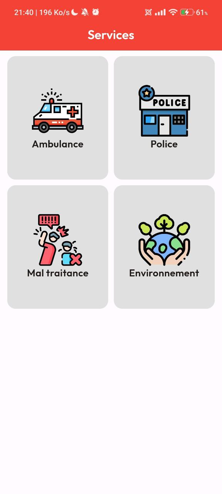

# Emergency

## Description

**Emergency** est une application polyvalente, disponible sur mobile et desktop, développée avec [Flutter](https://flutter.dev) et alimentée par une API [Django](https://www.djangoproject.com). Conçue pour améliorer la réponse aux situations critiques, **Emergency** offre une série de fonctionnalités essentielles pour offrir un soutien immédiat en cas de besoin.

### Fonctionnalités

- **Signalement d'Accidents** : Signalez rapidement les accidents aux ambulances les plus proches pour une intervention rapide.
- **Notification des Autorités** : Informez les autorités locales sur les zones nécessitant un nettoyage ou une intervention.
- **Affichage des Numéros d'Urgence** : Consultez facilement les numéros de contact pour les services d'urgence.
- **Chatbot de Premiers Secours** : Accédez à un chatbot qui fournit des conseils pratiques sur les premiers soins en cas d'accident ou de maladie.

### Technologies Utilisées

- **Flutter** : Pour le développement de l'application mobile et desktop.
- **Django** : Pour la gestion de l'API backend.

### Installation

Pour installer et exécuter **Emergency** en local, suivez ces étapes :

1. **Cloner le Dépôt** :
   ```bash
   git clone https://github.com/yourusername/emergency.git
   cd emergency


.
.
.
.
.
.
